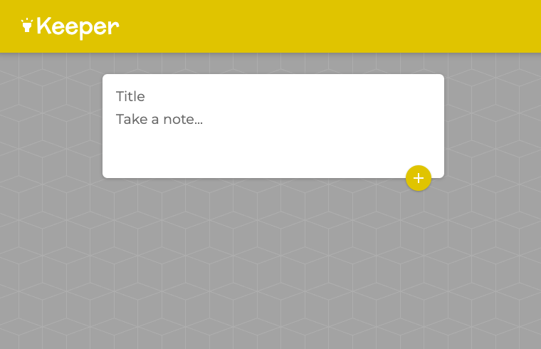

# The Keeper App

This is a repo that houses the base code for a React.js application. The Keeper App is a place where yo can make so a variety of of activities from shoping list, take notes to brainstorming for projects. The user is able to add, edit and delete its titles and main content of any of the or list  or ideas at any time!

You can see this project running [here](https://pipe-mv.github.io/the-keeper-notes-app/).

---

### Setting Up

* Fork or clone this repository.

* You can run this with `npm install` and then run  `npm start` which will take you to the landing site.

---

